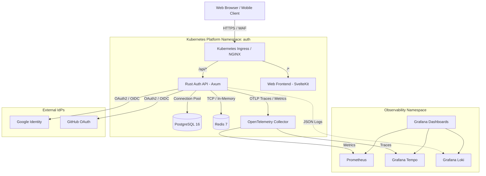

# System Architecture

## 1. Overview

`secure-auth-platform` is a high-performance, security-hardened authentication and identity platform built with a modular monorepo architecture. The platform combines a low-latency, memory-safe backend written in Rust (Axum framework) with a reactive, type-safe web frontend built with SvelteKit 5.



---

## 2. Monorepo Structure

```text
secure-auth-platform/
│
├── apps/
│   ├── auth-api/          # Rust 1.80 + Axum REST & Authentication Engine
│   └── web/               # SvelteKit 5 + TypeScript Web Application
│
├── packages/
│   └── shared-types/      # TypeScript DTOs & API Contracts
│
├── infrastructure/
│   ├── terraform/         # Cloud Infrastructure as Code (AWS EKS, RDS, Redis)
│   ├── kubernetes/        # Kustomize GitOps Manifests (base, dev, prod)
│   └── helm/              # Helm Charts for Unified Application Packaging
│
├── observability/
│   ├── prometheus/        # Scrape rules and metrics collection
│   ├── grafana/           # Datasource configurations & pre-built dashboards
│   ├── loki/              # High-throughput log aggregation
│   └── tempo/             # Distributed tracing storage
│
├── .github/
│   └── workflows/
│       ├── ci.yml         # Continuous integration & build verification
│       ├── security.yml   # Dependency audit, secret scan, Trivy container audit
│       └── release.yml    # GitOps production release automation
│
├── docker/
│   ├── Dockerfile.api     # Multi-stage distroless Rust build
│   ├── Dockerfile.web     # Minimal Alpine Node.js production server
│   └── README.md
│
├── docs/
│   ├── architecture.md    # System architecture & component design (this file)
│   ├── authentication.md  # Authentication, token rotation & session lifecycles
│   ├── security.md        # Threat mitigation, RBAC, and defense-in-depth
│   └── deployment.md      # Local orchestration, K8s, Helm & GitOps workflows
│
├── docker-compose.yml     # Local multi-service orchestration
└── README.md              # Monorepo developer guide
```

---

## 3. Core Components

### 3.1 Auth API (`apps/auth-api`)

- **Language & Framework**: Rust 1.80 with [Axum](https://github.com/tokio-rs/axum) and [Tokio](https://tokio.rs/) async runtime.
- **Layered Architecture**:
  - **Handlers (`src/handlers/`)**: Transport layer handling HTTP requests, query parameters, deserialization, and HTTP status codes.
  - **Services (`src/services/`)**: Core business logic, token generation, Argon2id verification, session orchestration, audit dispatching.
  - **Repositories (`src/repositories/`)**: Data access layer interfacing with PostgreSQL via SQLx compile-time checked queries and Redis.
  - **Middleware (`src/middleware/`)**: Authentication extraction, RBAC authorization, token bucket rate limiting, double-submit CSRF validation, security headers, distributed tracing context propagation.
  - **Models (`src/models/`)**: Strongly-typed domain models (User, Session, TokenFamily, AuditLog, Role, Permission).

### 3.2 Web Frontend (`apps/web`)

- **Framework**: SvelteKit 2 running on Svelte 5 (Runes reactivity `$state()`, `$derived()`).
- **Rendering**: Hybrid SSR (Server-Side Rendering) with client-side hydration for optimal performance and SEO.
- **Contract Integration**: Directly imports data schemas and contracts from `@secure-auth/shared-types`.
- **State Management**: Reactive session store with automatic token refreshing, route guards, and multi-tab sync.

### 3.3 Shared Types (`packages/shared-types`)

- **Purpose**: Defines shared TypeScript interfaces for requests, responses, sessions, audit events, and user models.
- **Benefit**: Guarantees end-to-end type safety between the API endpoints and frontend consumers without schema drift.

---

## 4. Data Layer Architecture

```text
┌─────────────────────────────────────────────────────────────┐
│                    PostgreSQL 16 (Primary)                  │
├─────────────────────────────────────────────────────────────┤
│ • users: UUID, email, hashed_password (Argon2id), status    │
│ • sessions: UUID, user_id, user_agent, ip, expires_at      │
│ • oidc_accounts: provider, provider_user_id, user_id        │
│ • token_families: family_id, user_id, current_hash, counter │
│ • roles / permissions: RBAC role mappings                   │
│ • audit_logs: append-only security and auth audit trail     │
└─────────────────────────────────────────────────────────────┘
                               ▲
                               │ Cache Aside / Invalidation
                               ▼
┌─────────────────────────────────────────────────────────────┐
│                       Redis 7 (Cache)                       │
├─────────────────────────────────────────────────────────────┤
│ • session:<session_id>     -> Fast session validation       │
│ • ratelimit:<ip>:<route>   -> Token-bucket rate counters    │
│ • blacklist:<token_jti>    -> Revoked JWT blacklist         │
│ • tfam:<family_id>         -> Immediate reuse detection     │
└─────────────────────────────────────────────────────────────┘
```

---

## 5. Observability & Telemetry

1. **Distributed Tracing**:
   - Axum injects OpenTelemetry trace contexts (`traceparent` header).
   - Traces flow from `auth-api` to `otel-collector` (via OTLP gRPC port 4317) to Grafana Tempo.
2. **Metrics**:
   - Axum exposes Prometheus metrics at `/metrics` (request latency histograms, status codes, active connection pool counts).
   - Prometheus server scrapes targets every 15 seconds.
3. **Structured Logging**:
   - `tracing-subscriber` formats logs as structured JSON containing `trace_id`, `span_id`, user identifiers, and operation outcomes.
   - Logs are indexed by Loki and linked to Tempo spans in Grafana.
