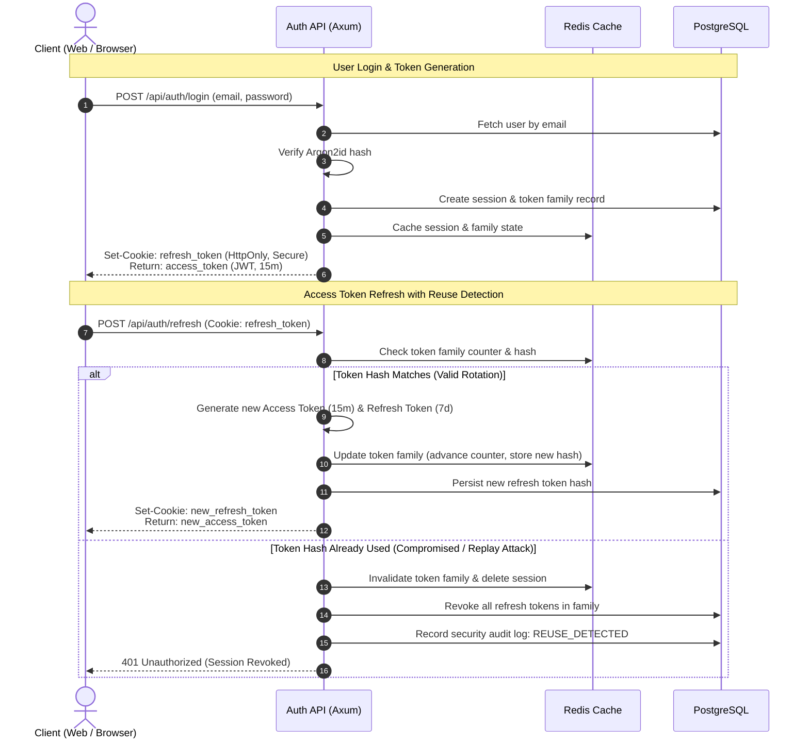
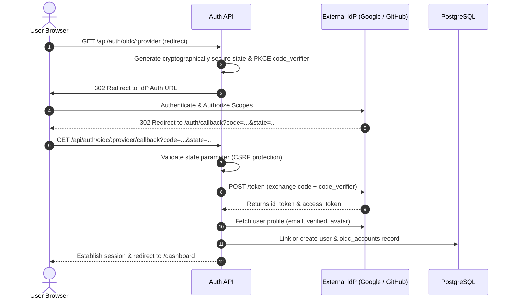

# Authentication & Identity Architecture

This document specifies the authentication flows, token rotation mechanics, session management, and cryptographic standards implemented across `secure-auth-platform`.

---

## 1. Credentials & Cryptography

### 1.1 Password Hashing (Argon2id)
All user passwords submitted during registration or password change are hashed using **Argon2id**, the winner of the Password Hashing Competition (PHC), configured with parameters optimized for resistance against GPU/ASIC attacks:
- **Variant**: `Argon2id`
- **Memory Cost ($m$)**: 64 MB (65536 KiB)
- **Time Cost ($t$)**: 3 iterations
- **Parallelism ($p$)**: 4 threads
- **Salt**: 16 bytes of cryptographically secure random bytes (`OsRng`)

Plaintext passwords are never logged, never returned in API payloads, and never stored in memory beyond the immediate verification scope.

---

## 2. Token Lifecycle & Rotation

The platform issues a dual-token pair upon successful authentication:

| Token Type | Lifespan | Transmission | Purpose |
|------------|----------|--------------|---------|
| **Access Token** | 15 minutes | HTTP Authorization header (`Bearer <JWT>`) | Stateless API request authorization |
| **Refresh Token** | 7 days | `HttpOnly`, `Secure`, `SameSite=Strict` Cookie | Issuing new access tokens via rotation |

### 2.1 Refresh Token Rotation & Reuse Detection
To eliminate the risk of long-lived token theft, every refresh request issues a brand-new refresh token and invalidates the previous one:
1. **Token Families**: Every login creates a unique `family_id`.
2. **Replay Detection**: If a client attempts to exchange an already-used refresh token, the server assumes token theft has occurred.
3. **Immediate Revocation**: The server immediately revokes the **entire token family** and deletes the underlying active session, forcing all legitimate and malicious holders to re-authenticate.

---

## 3. OIDC / Social Authentication

The platform supports OpenID Connect (OIDC) and OAuth 2.0 with:
- **Google Identity Services**
- **GitHub OAuth**

### OIDC Flow

---

## 4. Session Management

- **Concurrent Multi-Device Sessions**: Users can maintain active sessions across multiple browsers or devices simultaneously.
- **Session Metadata**: Every session captures:
  - Client IP Address
  - `User-Agent` string (browser and OS details)
  - Creation timestamp and `last_used_at` timestamp
- **Session Termination**:
  - `POST /api/sessions/:id/revoke`: Terminate a specific session.
  - `POST /api/sessions/revoke-others`: Terminate all sessions except the current active session.
  - `POST /api/auth/logout`: Revoke current session and clear authentication cookies.

---

## 5. Cookie Security & CSRF Defense

1. **Cookie Configuration**:
   - `HttpOnly`: Prevents JavaScript access (`document.cookie`), mitigating XSS-based token theft.
   - `Secure`: Ensures cookies are transmitted solely over TLS (HTTPS).
   - `SameSite=Strict`: Restricts cookies from being transmitted in cross-site requests.
2. **CSRF Double-Submit Mechanism**:
   - For state-mutating requests (`POST`, `PUT`, `DELETE`, `PATCH`), clients transmit an anti-CSRF token in the `X-CSRF-Token` header matching a cryptographically signed cookie token.
